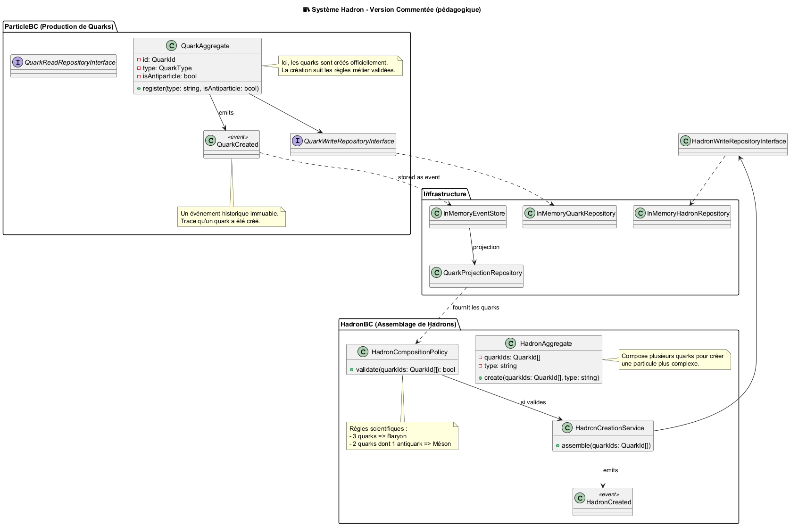

# 📚 Projet Hadron – Documentation

## 🎯 Objectif du projet

Le projet **Hadron** est une **simulation logicielle conceptuelle** inspirée de la physique des particules.  
Il vise à **modéliser**, **composer** et **contrôler** la création de particules subatomiques telles que :

- les **quarks**
- les **hadrons** (ex : **baryons** et **mésons**)

Le but n’est **pas** de créer un moteur physique réel ou un logiciel scientifique de laboratoire,  
mais de **montrer comment modéliser un domaine complexe** grâce à des techniques d’ingénierie  
utilisées dans des systèmes critiques (banques, IA, aéronautique, santé, énergie, blockchain, etc.).

➡️ **Nous utilisons la physique comme exemple pour apprendre à construire des logiciels complexes, fiables et non corrompables.**

---

## 🧠 Pourquoi ce projet est intéressant ?

Ce projet sert à apprendre ou démontrer :

| Domaine               | Apprentissage                                        |
| --------------------- | ---------------------------------------------------- |
| Modélisation métier   | Transformer des lois physiques en règles logicielles |
| Architecture critique | Sécuriser les états et éviter les incohérences       |
| Domain-Driven Design  | Construire autour du langage métier                  |
| CQRS & Event Sourcing | Traçabilité complète des actions                     |
| Immutabilité stricte  | Empêcher les corruptions d'état                      |
| Modules indépendants  | Communication inter-domaines                         |
| Contrats Protobuf     | Standardisation inter-application                    |

---

## 🏗️ Vue d’ensemble

Le système contient **deux zones logiques indépendantes** appelées _Bounded Contexts_ :

| Bounded Context (BC) | Rôle                                 | Métaphore       |
| -------------------- | ------------------------------------ | --------------- |
| **Particle BC**      | Création officielle des quarks       | Usine certifiée |
| **Hadron BC**        | Composition scientifique des hadrons | Laboratoire     |

Cette séparation garantit :

✔ indépendance  
✔ versionnage simple  
✔ évolutivité  
✔ traçabilité  
✔ aucune corruption d’état

---

## 📐 Diagramme d’architecture

Voici une vue d’ensemble du projet Hadron illustrant les relations entre Particle BC (supplier) et Hadron BC (consumer), avec Event Sourcing et CQRS :



---

## 🔌 Technologies utilisées

| Technologie                    | Rôle                        |
| ------------------------------ | --------------------------- |
| **PHP 8.2+ / compatible 8.5**  | Langage principal           |
| **Domain-Driven Design (DDD)** | Conception métier           |
| **Hexagonal Architecture**     | Isolation du domaine        |
| **CQRS**                       | Séparation commande/lecture |
| **Event Sourcing (simplifié)** | Historisation permanente    |
| **ramsey/uuid (v4)**           | Identifiants fiables        |
| **Protobuf (.proto)**          | Contrats inter-services     |
| **TDD + PHPUnit**              | Validation continue         |

---

## 📦 Fonctionnement simplifié

1️⃣ L’utilisateur crée des **quarks** via le Particle BC  
2️⃣ Le domaine valide la création selon les règles métier  
3️⃣ Les quarks peuvent ensuite être utilisés pour créer des **hadrons**  
4️⃣ Le Hadron BC applique ses propres règles  
5️⃣ Une tentative non scientifique renvoie une **erreur métier contrôlée**

### Exemple

| Action                                    | Résultat    |
| ----------------------------------------- | ----------- |
| Créer 3 quarks → baryon                   | ✔ Valide    |
| Créer 2 quarks → méson (dont 1 antiquark) | ✔ Valide    |
| 4 quarks dans un hadron                   | ❌ Interdit |
| 2 quarks identiques pour méson            | ❌ Interdit |

---

## 💎 Pourquoi autant de validations ?

Dans certains domaines, **une erreur peut être catastrophique** ou coûte extrêmement cher :

- banque ou crypto → pertes financières
- médical → mauvaise dose
- aéronautique → crash
- IA autonome → actions dangereuses

La philosophie du projet :

> **Mieux vaut empêcher l'action que produire un état faux.**

---

<!-- ## 🌍 Vision long-terme

Le projet peut évoluer vers :

- simulateur quantique visuel
- plateforme éducative
- API publique pédagogique
- serious game scientifique
- plugin Unity, Godot ou WebGL

--- -->

## 👥 Public visé

| Public        | Objectif                          |
| ------------- | --------------------------------- |
| Débutants     | Comprendre la modélisation métier |
| Étudiants     | Apprendre la logique scientifique |
| Dev confirmés | Améliorer les architectures       |
| Architectes   | Étude de cas DDD avancé           |
| Enseignants   | Support de cours                  |

---

<!-- ## 🎤 Résumé en une phrase

> **Hadron est un projet éducatif qui montre comment créer un système logiciel complexe et sûr en s’inspirant des lois physiques réelles.**

--- -->

## ❓ FAQ

| Question                            | Réponse |
| ----------------------------------- | ------- |
| C'est un vrai moteur scientifique ? | Non     |
| Peut-on étendre les règles ?        | Oui     |
| Peut-on faire une UI ?              | Oui     |
| Compatible microservices ?          | Oui     |
| Utilisable pour l’enseignement ?    | Oui     |

<!-- ---

## 🚀 Prochaines étapes possibles

1️⃣ Documentation interactive web
2️⃣ Visualisation scientifique 3D
3️⃣ API publique éducative
4️⃣ Version gamifiée
5️⃣ Intelligence artificielle pédagogique

---

# Hadron Project (demo)

This project demonstrates:

- ParticleBC (Quark supplier) and HadronBC (consumer)
- CQS, Event Sourcing (in-memory), projections
- gRPC `.proto` stubs (for inter-BC)
- Slim REST endpoints (minimal)
- MkDocs docs skeleton
- PHPUnit tests (TDD)

Requirements:

- PHP 8.1+
- composer
- Optional: protoc and gRPC PHP plugin for protocol buffers

Install:

```
composer install
vendor/bin/phpunit
php -S 0.0.0.0:8080 -t public
``` -->
